

## LiveLiNQ Evidence インストール手順
  
### インストーラ―のダウンロード
「LiveLiNQ Evidence」のインストーラ－（zipファイル）を以下よりダウンロードします。

＜Odoo EvoLiNQサイトのEコマースへのリンク＞

### zipファイルの解凍
ダウンロードしたzipファイルを解凍し、フォルダ内にあるインストーラ－（.exeファイル）を実行します。

### アプリケーションのインストール
インストーラーを実行すると、以下の画面が表示されます。

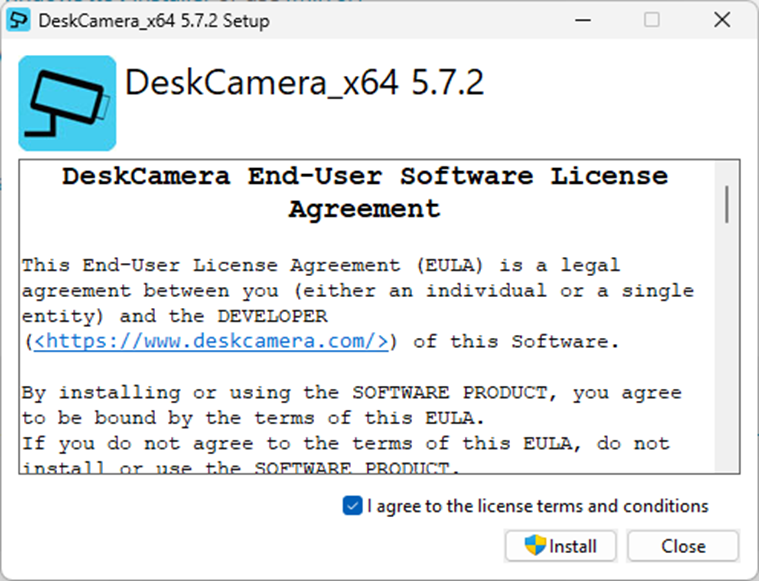
表示された画面の「I agree to the license terms and condition」（ライセンス条項に同意する）にチェックを入れ、
「Install」をクリックします。

＜ユーザーアカウント制御画面＞
ユーザーアカウント制御のポップアップが出力されるので、「はい」をクリックします。

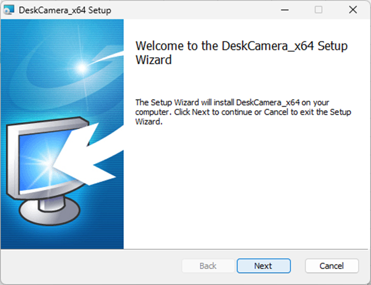
表示された画面の「Next」をクリックします。

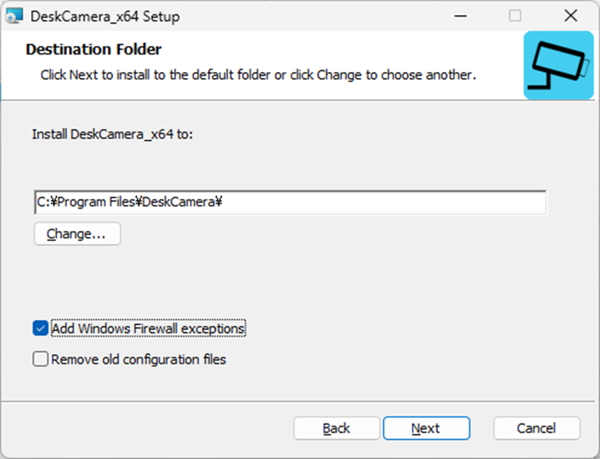
遷移した画面の「Add Windows Firewall exceptions」（Windowsファイアウォールの例外を追加する）にチェックを入れ、
「Next」をクリックします。

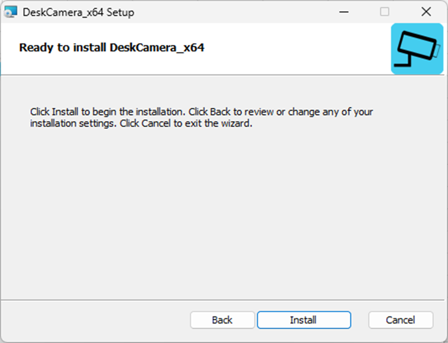
遷移した画面の「Install」をクリックします。

遷移した画面の「Finish」をクリックします。

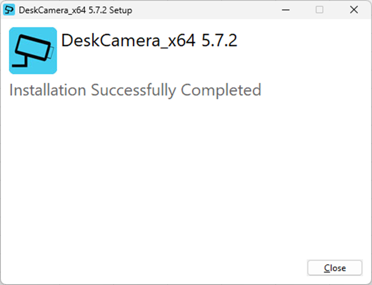
インストールの完了を通知する画面が表示されるので、「close」をクリックします。

### ライセンスのアクティベート
「LiveLiNQ Evidence」を初回起動すると、以下の画面が表示されます。

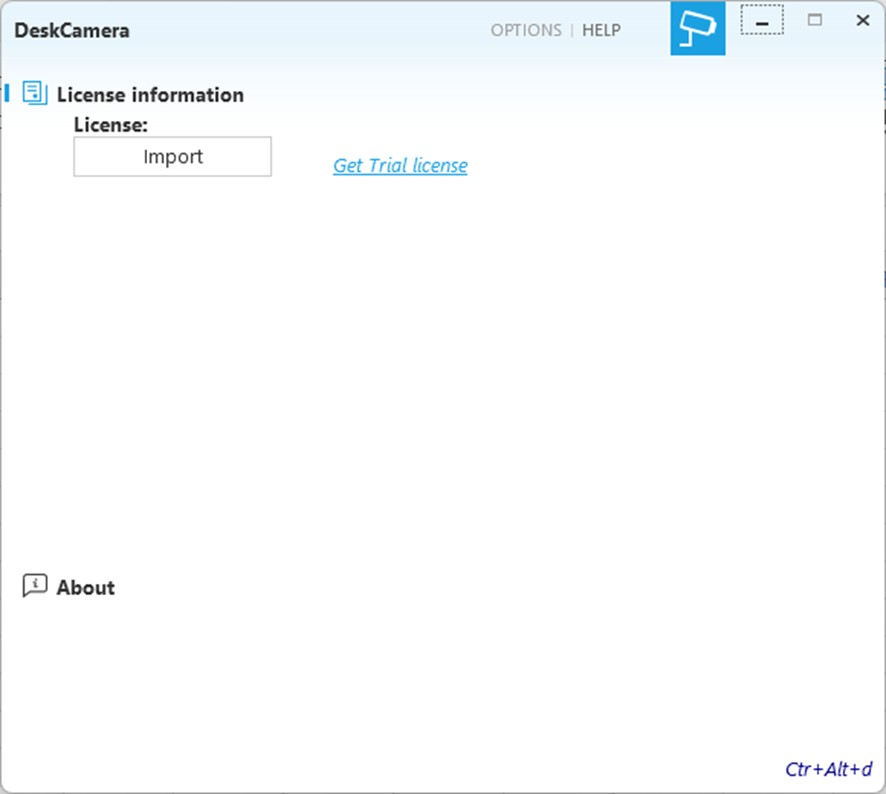
表示された画面の「Import」をクリックします。

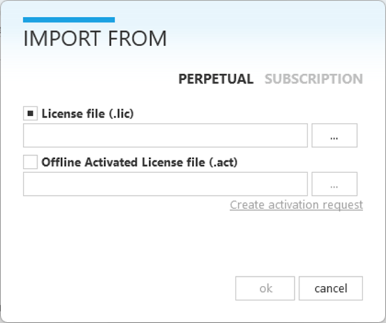
表示された画面に事前に取得したライセンス情報を入力し、アプリケーションを有効化します。
※ 有効化の手順は契約形態により分岐します。  

①永続ライセンスの場合  
「PERPETUAL」（永続化）のタブをクリックし、永続ライセンスの有効化画面を表示します。  

「License file (.lic)」 をチェックし、「…」をクリックします。  
表示されたファイルエクスプローラーから、ライセンスファイルを選択します。  
選択後、「ok」をクリックし、アクティベートは完了です。

※ オフライン環境のPCにインストールする場合  
オフライン環境のPCにインストールする場合、PCに「Microsoft .Net Framework 4.5」がインストールされている必要があります。  

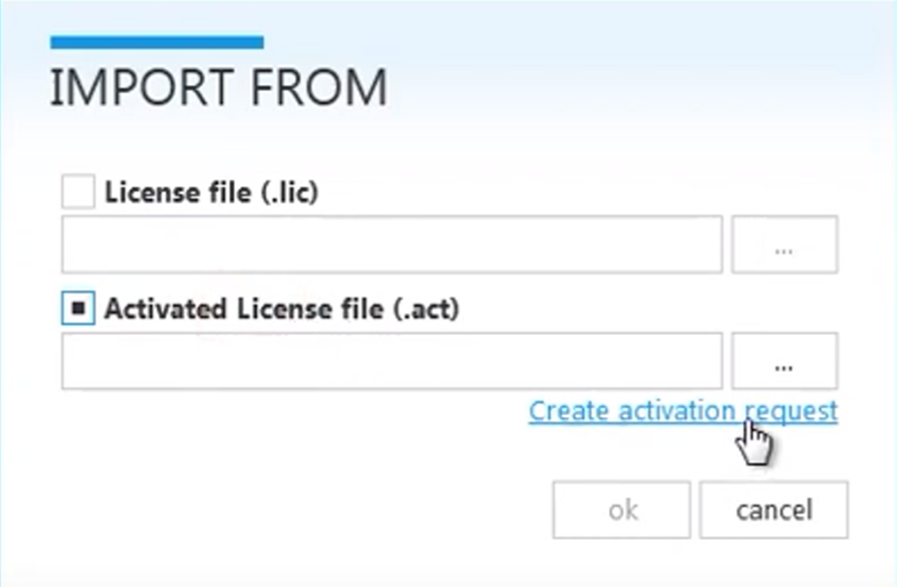
永続ライセンスの有効化画面より、「Activated License file (.act)」をチェックし、「Create activation request」をクリックします。

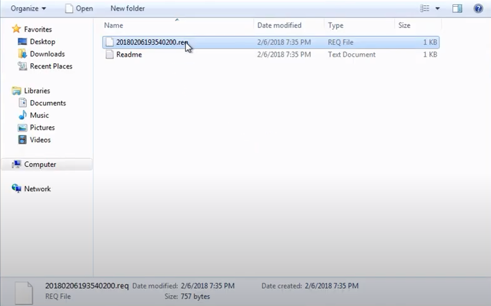
表示されたファイルエクスプローラーから、末尾が「.req」のファイルを選択し、作業フォルダにコピーします。  

下記リンクから、オフライン用のライセンスファイルを作成するWEBサイトにアクセスします。  
https://www.activationservice.net/

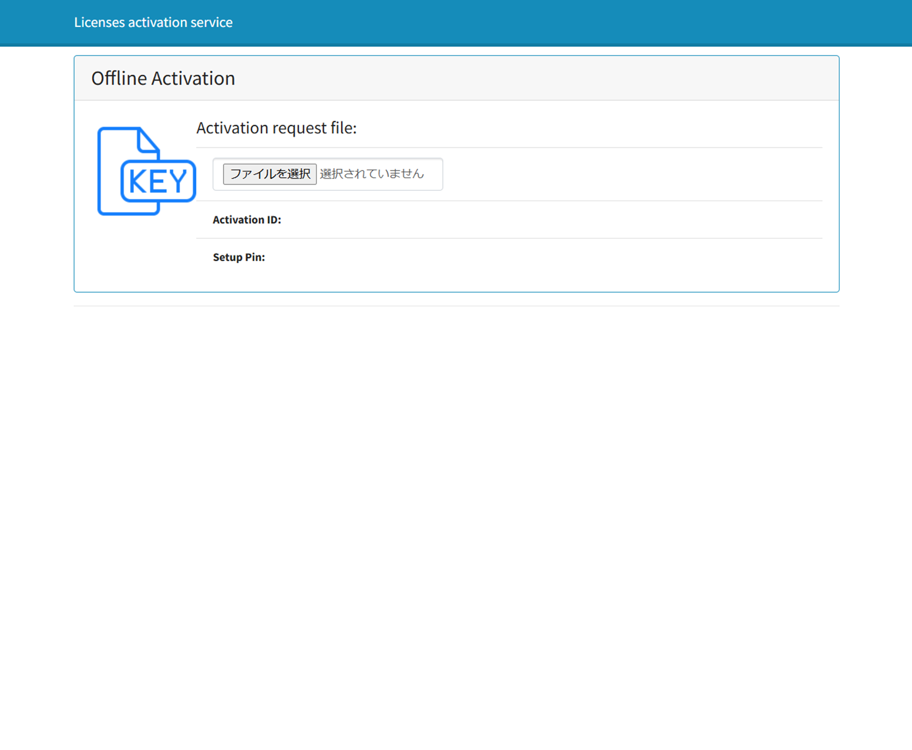
WEBサイトの画面から「ファイルを選択」をクリックします。　　

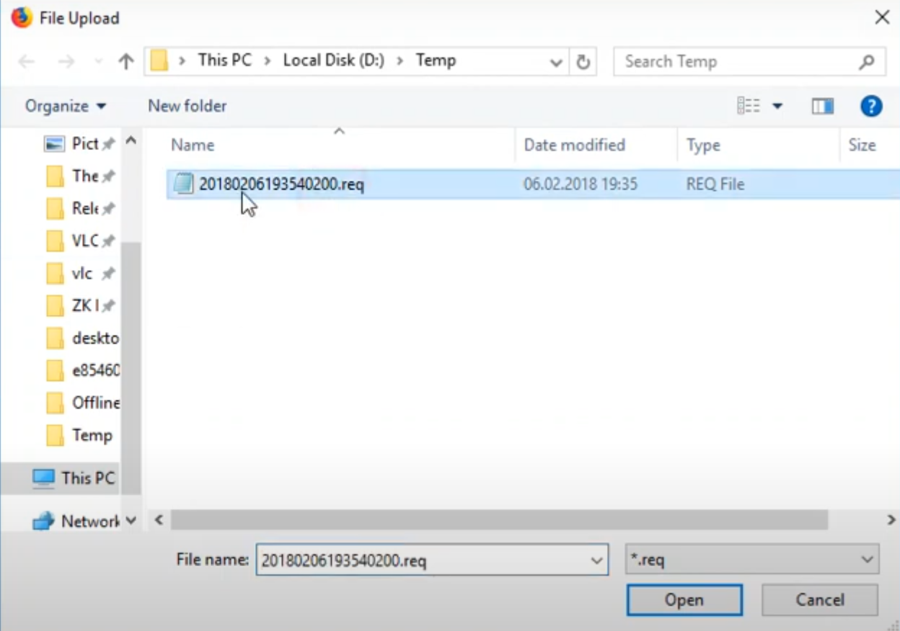
表示されたファイルエクスプローラーから、作業フォルダにコピーした「.req」ファイルを選択します。

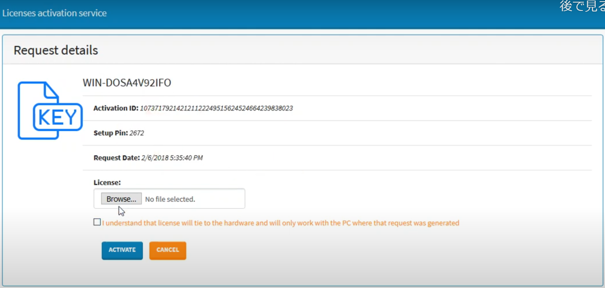
選択後、「License」の項目が追加されるので、隣にある「ファイルを選択」をクリックします。  

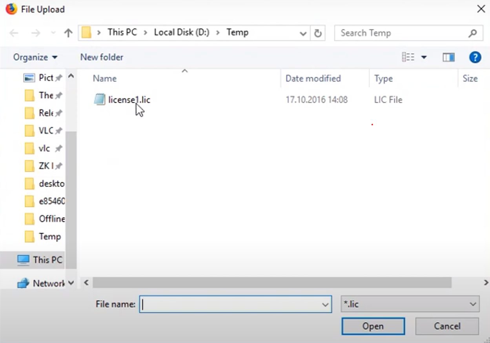
表示されたファイルエクスプローラーから、ライセンスファイルを選択します。  

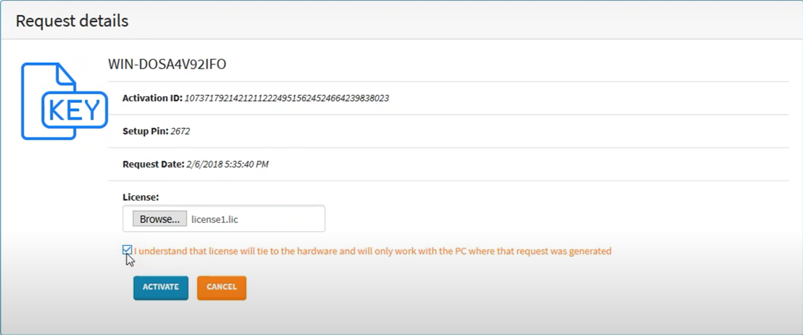
その後、「I understand that license will tie to the hardware and will only work with the PC where that request was generated」と記載のあるチェックボックスにチェックをし、「ACTIVATE」をクリックします。  

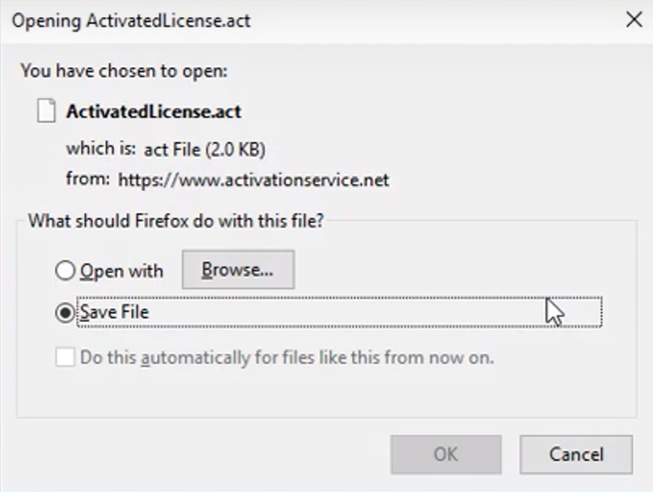
クリック後、画面が遷移し、ポップアップが表示されます。  
表示されたポップアップ内の「OK」をクリックします。

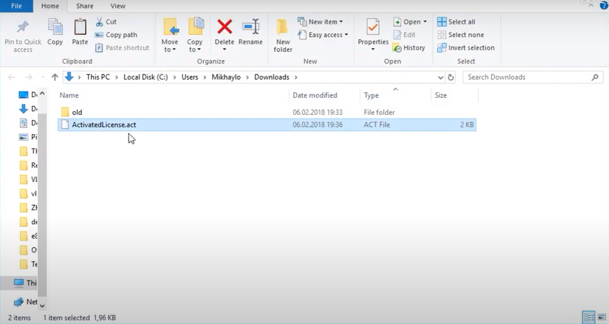
クリック後、末尾が「.act」のファイルがダウンロードされるので、作業フォルダにコピーします。  

結合サイトを閉じ、永続ライセンスの有効化画面に戻ります。

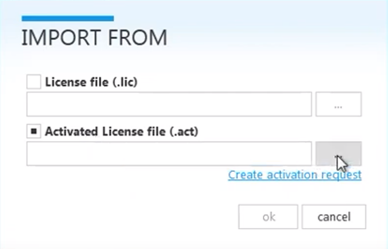
永続ライセンス有効化画面の「Activated License file (.act)」の「…」をクリックします。

表示されたファイルエクスプローラーから、先ほど作業フォルダに保存した「.act」のファイルを選択します。

選択後、「ok」をクリックし、アクティベートは完了です。

②サブスクリプションの場合
「SUBSCRIPTION」（サブスクリプション）のタブをクリックし、サブスクリプションの有効化画面を表示します。　　

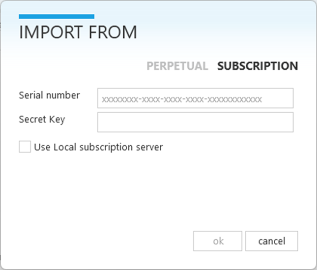
ライセンス情報の中から、「Serial number」と「Secret Key」を画面の対応するところに転記します。
転記後、「ok」をクリックし、アクティベートは完了です。
