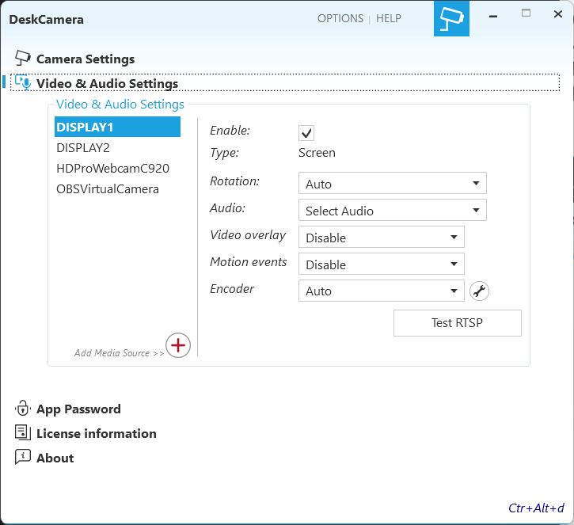
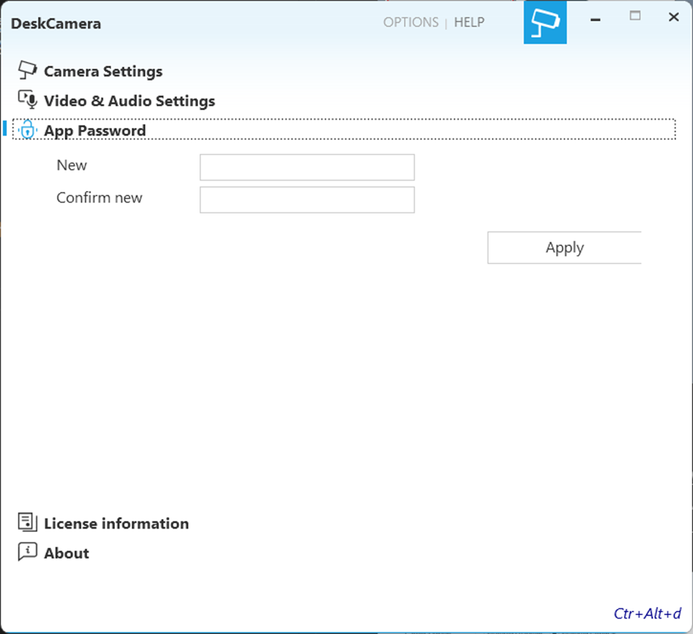

# LiveLiNQ Evidence 利用マニュアル

## 基本的な使用方法
LiveLiNQ Evidence の起動からの基本的な使用方法を説明します。

### アプリの起動
LiveLiNQ Evidence はインストール後、バックグラウンドで起動します。  
画面を表示したい場合は、タスクバーのシステムトレイからアイコンをクリックします。

クリック後、下記ウィンドウが表示されます。  

初期状態では、PCに接続されている機器（カメラ等）と画面を自動で読み込み、一覧に表示します。  

アプリ起動時からストリームが開始された状態となっています。（初期状態では、一覧に表示されたすべての機器・画面についてストリームを開始します）  

ストリームを停止する場合は、「stop」ボタンを押下。再度開始する場合は、「start」ボタンを押下します。

### ストリーム設定
ストリームの設定を変更する場合、「Stop」ボタンを押下し、ストリームを一度終了する必要があります。

「ビデオ＆オーディオ設定」をクリックします。
  

表示された画面から、一覧にある各ストリームについて設定を行います。
  

#### 各種設定項目
ストリームに対しての設定項目は以下の通りです。

設定後、カメラ設定に戻り、「start」ボタンを押下します。

カメラの一覧が表示されれば、設定した内容でストリームが開始されています。

### カメラモード設定  
「カメラ設定」をクリックし、表示された画面からカメラモードを設定します。
  

#### カメラモードについて
LiveLiNQ Evidence には2つのカメラモードがあります。  

１．マルチチャンネル  
マルチチャンネルモードでは、起動中のカメラ一覧に表示されている各ソースを、１つの仮想カメラ（ONVIFデバイス）として、まとめて出力します。全てのカメラが、同じIPアドレス・ポートを共有します。  
  

クライアントソフト（NVR/VMS）から見たカメラの表示  
  

２．マルチカメラ  
マルチカメラモードでは、起動中のカメラ一覧に表示されている各ソース毎に仮想カメラ（ONVIFデバイス）を作成し、出力します。全てのカメラが、同じIPアドレスを共有しますが、ポートは個々に違うものが割り当てられます。  
  

クライアントソフト（NVR/VMS）から見たカメラの表示  
  

### ONVIFユーザー設定
クライアント（NVR/VMS）からストリームに接続する際に使用する認証情報を設定します。接続時には、ここで設定したユーザーIDとパスワードが必要になります。  

クライアントソフトの入力例

### アプリパスワード設定
アプリパスワードを設定することで、設定変更やストリーミングの停止操作に制限をかけることができます。  
「アプリパスワード」をクリックし、設定欄を開きます。
  

設定するパスワードを入力し、適用をクリックしてパスワードを設定します。
  

設定変更やストリーミングの停止を行う場合、以下の画面が表示され、認証されるまで制限がかかります。  
  

###　ライセンス情報
使用しているライセンスの情報について確認することができます。  
「ライセンス情報」をクリックし、表示欄を開きます。
  

### オプション設定
オプション画面で設定できる項目について、代表的なものを解説します。  

#### ホットキーの有効化
「ctl + alt + d」キーを入力することで、アプリのウィンドウを表示できるようにします。
  

#### 秘匿モードの有効化  
タスクバーのシステムトレイにアプリアイコンを表示させないようにします。
（アプリのウィンドウを開く場合は、「ctl + alt + d」キーを入力します）

#### アプリアップデート設定  
アプリのアップデートを自動化するか設定します。  
また、「更新プログラムのチェック」ボタンを押下することで、現在のアップデートを確認することができます。
